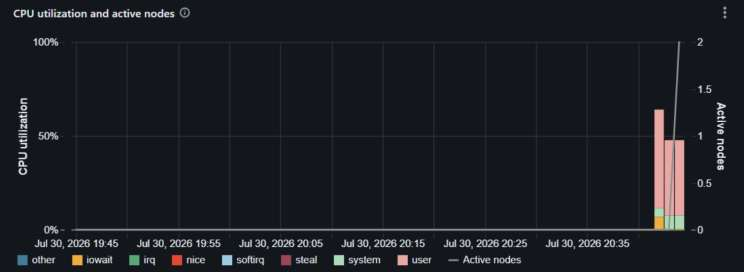
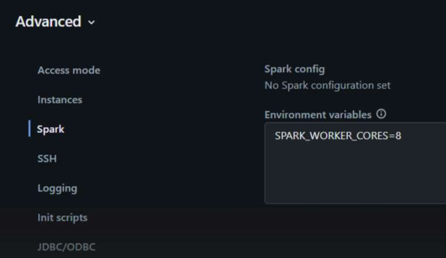
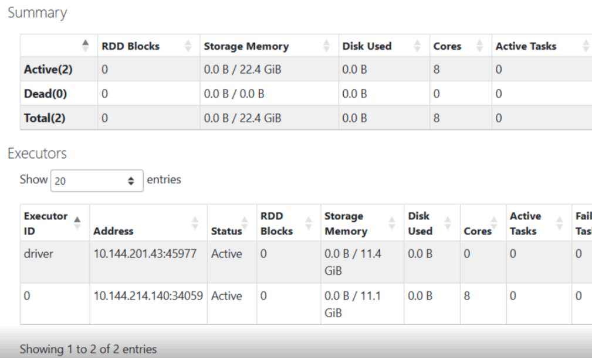

Open the compute metrics page for one of your jobs. There is a good chance you will see this
picture.

CPU stays between 20 and 50 percent. The number of nodes grows anyway. And you pay for every
node: the cloud VM, plus the DBUs on top.

This story repeats in two versions. In one, a streaming job on a fixed-size cluster falls
behind, so you add nodes by hand. In the other, a batch job on an autoscaling cluster asks for
nodes on its own. Both times, you buy machines to clear a queue of waiting tasks. But CPU was
never the thing that ran out.

## What runs out is slots, not cores

Spark cuts work into tasks. By default,
[one running task takes one core](https://spark.apache.org/docs/latest/configuration.html#:~:text=Number%20of%20cores%20to%20allocate%20for%20each%20task).
So a worker with 4 cores runs 4 tasks at the same time. These are the task slots. Read a Kafka
topic with 8 partitions, and
[the connector creates 8 tasks](https://spark.apache.org/docs/latest/streaming/structured-streaming-kafka-integration.html#:~:text=Spark%20has%20a%201-1%20mapping%20of%20topicPartitions%20to%20Spark%20partitions):
4 run, 4 wait in a queue.

Here is the trap. A task keeps its slot even while it does nothing. A task that waits for
Kafka, object storage, or a JDBC database still holds its core. The core is idle, but no other
task can use it. To the scheduler, the cluster looks full. To the CPU chart, it looks empty.
Both are telling the truth.

Small files create the same queue. Spark
[packs input files into partitions](https://spark.apache.org/docs/latest/sql-performance-tuning.html#:~:text=The%20maximum%20number%20of%20bytes%20to%20pack%20into%20a%20single%20partition)
of up to 128 MB (`spark.sql.files.maxPartitionBytes`), but it also
[adds an opening cost for every file](https://spark.apache.org/docs/latest/sql-performance-tuning.html#:~:text=The%20estimated%20cost%20to%20open%20a%20file)
of 4 MB (`spark.sql.files.openCostInBytes`), and both settings apply to JSON. So a 12 KB file
counts as 4 MB, and one partition holds at most 32 of them. Ten thousand small files become at
least 313 tasks, and each task makes its own separate request to object storage.

## Prove it before you change anything

Do not use `iowait` for this. Linux counts only blocking disk I/O there. Waiting on Kafka or S3
over the network is counted as plain idle time, so `iowait` will show near zero even when every
task is waiting.

The real evidence is in the Spark UI. Open a stage and compare each task's duration with its
CPU time. A long task with almost no CPU time is a task that spends its life waiting.

For a second proof, run the job with fewer machines, or a lower autoscaling maximum, and watch
the CPU chart. If utilization does not rise to fill the gap, the cores were never the limit.
The job may run slower during this test. That is fine: it is a test, not the fix.

:::warning
`SPARK_WORKER_CORES` is
[documented by Apache Spark](https://spark.apache.org/docs/latest/spark-standalone.html#:~:text=Total%20number%20of%20cores%20to%20allow%20Spark%20applications%20to%20use),
where it configures a standalone-mode Worker. The undocumented part is that it works on
Databricks. Databricks does not document the
variable, does not document the standalone master and worker that run under your cluster, and
commits to neither. Any runtime upgrade could change this behavior without notice.
:::

## The fix: more slots, not more nodes

`SPARK_WORKER_CORES` is the
["total number of cores to allow Spark applications to use on the machine"](https://spark.apache.org/docs/latest/spark-standalone.html#:~:text=Total%20number%20of%20cores%20to%20allow%20Spark%20applications%20to%20use%20on%20the%20machine).
By default it equals the real core count. On an `rd-fleet.xlarge` (4 cores, 32 GB) that is 4.

Setting it to 8 does not create new cores. It tells Spark to run 8 task threads at once on the
4 cores you have. Now, when a thread sits waiting for Kafka, another thread can use the idle
core. In other words, all you really change is a name: 4 cores, now called 8. Databricks
renames things all the time. This time, you do the renaming. No migration guide, no deprecation
notice, just a cluster restart.

Set it under **Advanced options -> Spark ->
[Environment variables](https://docs.databricks.com/aws/en/compute/configure#:~:text=Configure%20custom%20environment%20variables%20that%20you%20can%20access%20from)**
and restart the cluster.
Prefer {{entry:lakeflow-jobs}} compute over an interactive cluster while you are there.

Two preconditions. First, the access mode: on standard compute,
[only a predefined list of environment variables reaches the Spark engine and init scripts](https://docs.databricks.com/aws/en/compute/standard-limitations#:~:text=Only%20a%20predefined%20set%20of%20environment%20variables%20is%20available),
and `SPARK_WORKER_CORES` is not on that list, so on standard compute the variable never
arrives. You need the dedicated flavor of
{{entry:standard-and-dedicated-access-modes}}. Second, the cluster shape: single-node clusters
have no Worker process at all, see the last section.

Start with 6, about 1.5 times the physical cores. Run one full cycle of the job. Check
utilization, task duration, and memory. If all three look healthy, move to 8.

## Check that it worked

Open **Spark UI -> Executors**. The Cores column should read 8 on a 4-core machine.

You get one 8-core executor only if
[`spark.executor.cores` is unset](https://spark.apache.org/docs/latest/configuration.html#:~:text=all%20the%20available%20cores%20on%20the%20worker%20in%20standalone%20mode),
which is the Databricks default. Set it to 4 and you get two 4-core executors instead: the same 8 slots, with the
memory split differently.

## What breaks first

Memory, not CPU. Eight tasks now share the heap that four tasks used to have. Expect more
garbage collection, and watch for `OutOfMemoryError`, Full GC pauses, and disk spill. If they
appear, lower the value, or move to a memory-optimized instance type.

| Your situation | What it looks like | What to change |
| --- | --- | --- |
| More tasks than slots | A mostly idle cluster keeps adding nodes | [`SPARK_WORKER_CORES`](https://spark.apache.org/docs/latest/spark-standalone.html#:~:text=Total%20number%20of%20cores%20to%20allow%20Spark%20applications%20to%20use) |
| More slots than partitions | Cores sit unused because no task is queued | [`minPartitions`](https://spark.apache.org/docs/latest/streaming/structured-streaming-kafka-integration.html#:~:text=Spark%20has%20a%201-1%20mapping%20of%20topicPartitions%20to%20Spark%20partitions) |
| Thousands of tiny files | Hundreds of short tasks, each opening one file | Compact the files |
| One task blocks a slot for a long time | The task really needs more than one core | [`spark.task.cpus`](https://spark.apache.org/docs/latest/configuration.html#:~:text=Number%20of%20cores%20to%20allocate%20for%20each%20task) |

:::judgement
If you own the process that writes the files, compact the files first, before touching any of
this. And I stop at 2 times the physical cores. That is a personal rule, not a documented
ceiling. There is no documented ceiling, because there is no documented technique.
:::

## The fraction that does not exist yet

The [migration guide for the upcoming Spark 4.3](https://github.com/apache/spark/blob/16d4c73da4943b57996db2936a716b80a1eb6dfe/docs/core-migration-guide.md)
says that since Spark 4.3, `spark.task.cpus` accepts fractional values, and the Python
`TaskContext` gains a
[cpuAmount() method](https://github.com/apache/spark/blob/16d4c73da4943b57996db2936a716b80a1eb6dfe/python/pyspark/taskcontext.py#L282)
that returns the possibly fractional amount. Until a Databricks Runtime ships that Spark
version, the only lever for running more task threads than cores is still the undocumented one
above.

:::judgement
The day a Databricks Runtime ships Spark 4.3, a documented `spark.task.cpus` of 0.5 beats the
undocumented `SPARK_WORKER_CORES` trick, and the fix in this guide becomes the fallback for
older runtimes. Check your runtime's Spark version before choosing.
:::

## Not on single-node clusters

A single-node cluster has no Worker process to configure. The
["driver acts as both master and worker"](https://docs.databricks.com/aws/en/compute/configure#:~:text=Driver%20acts%20as%20both%20master%20and%20worker),
running Spark locally and
["spawns one executor thread per logical core in the compute resource, minus 1 core for the driver"](https://docs.databricks.com/aws/en/compute/configure#:~:text=Spawns%20one%20executor%20thread%20per%20logical%20core).
Read that layout twice: the task threads share one machine with the driver, and the documented
default already holds a core back for it. The equivalent knob would be the thread count in
`spark.master`, and Databricks does not
support overriding it on single node in the UI. And no, the 4 in `local[*, 4]` is not a core
count: it is
[the number of allowed task failures](https://spark.apache.org/docs/latest/submitting-applications.html#:~:text=Run%20Spark%20locally%20with%20K%20worker%20threads%20and%20F%20maxFailures).

:::judgement
Which is a knob I would not want anyway. On a multi-node cluster, oversubscribing a worker
risks that worker, and a lost executor gets retried. On single node there is no separate worker
to risk: extra task threads take their cores from the process holding the SparkContext, and
when the driver goes, the cluster goes with it. Databricks already warns that
["large-scale data processing will exhaust the resources on a single node"](https://docs.databricks.com/aws/en/compute/configure#:~:text=will%20exhaust%20the%20resources%20on%20a%20single%20node)
and to use multi-node instead. I read the missing knob as agreeing with that warning, not as an
oversight to route around.
:::

## What you actually save

This change does not lower any node's DBU rate. The saving is fewer nodes, or the same nodes
running for less time. So it is only real if slots were the true limit. If your cores were
genuinely busy, you gain nothing, and you pay for the attempt in memory pressure.

If you have tried this, I would like to hear two things: where you set your ceiling, and which
metric told you to stop.
